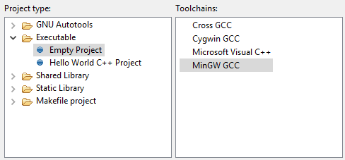
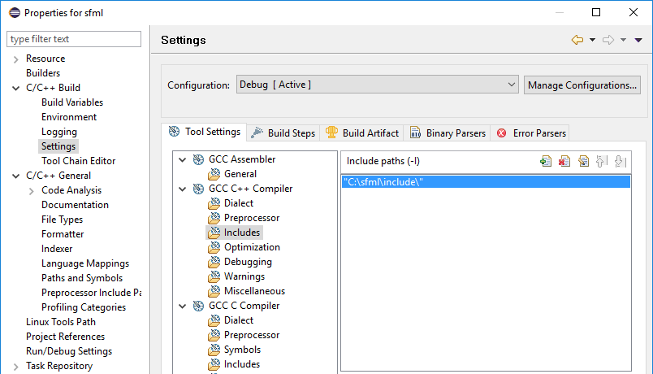
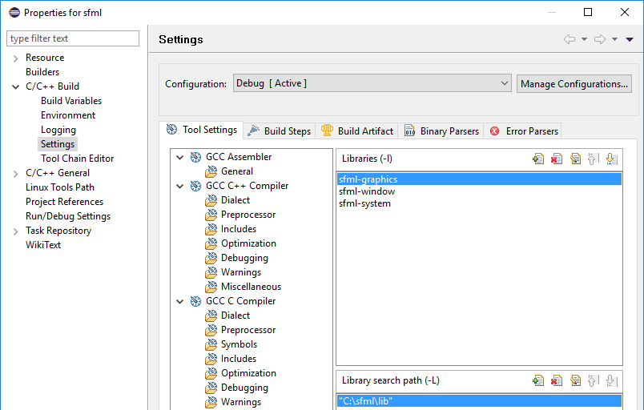
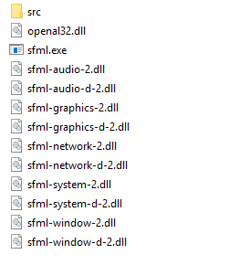

# SFML and Eclipse
## Foreword
I made this document for myself beacause there is no official Eclipse manual
for SFML yet. However since I'm not an expert not everything might be as
correct as it should be, so feel free to contribute.

This guide assumes, you have already setup Eclipse successfully.
Further this tutorial uses the GCC MinGw compiler and Windows 10.
If you are using another compiler or operating system you may have to
modify it slightly.

## Step 1: Download & Install SFML
### Download
Go to http://www.sfml-dev.org/ and Download the `GCC MinGw` Version.


The Website says, the Compiler versions have to match 100%. I was also
able to use it with a slightly newer compiler version (4.9.3), however if you
run into troubles later you should consider downloading the matching compiler
version, linked below the downloads.

### Installation
Extract the downloaded zip-file anywhere you want. In this Tutorial we will
use the path `C:\sfml`

## Step 2: Creating an Eclipse Project
Open _Eclipse Cpp_ and create a new project by clicking:
`File > New > C++ Project`.
Name the project whatever you want. Below select `Empty Project` as project
type and the `MinGW GCC` toolchain. Click on the `Finish` button to create your
Project.



## Step 3: Setup the Project-Properties
After you created your project right-click on it in the Project Explorer and
select `Properties`.
### Setup the include path.
Go to `C/C++ Build > Settings > Tool Settings > GCC C++ Compiler > Includes`
and add the path to the include folder of the SFML library by clicking on the
green plus-icon.


### Setup the library path.
Go to `C/C++ Build > Settings > Tool Settings > MinGW C++ Linker > Libraries`.
Under `Library search path (-L)` add the path to the lib folder of the SFML
library by clicking on the green plus-icon.

Under `Libraries (-l)` add the following: `sfml-graphics` `sfml-window`
`sfml-system`. Click _Apply_ and _OK_ to save the changes.


## Step 4: Creating a "Hello World" file
Right-click on your project folder and select `New > Folder` and then
right-click the new folder and select `New > File`. Name it `sfml.cpp`.


Copy the following code inside your file:

```c++
#include <SFML/Graphics.hpp>

int main()
{
    sf::RenderWindow window(sf::VideoMode(200,200), "Hello World");
    sf::CircleShape shape(100.f);
    shape.setPointCount(128);
    shape.setFillColor(sf::Color::Green);

    while (window.isOpen())
    {
        sf::Event event;
        while (window.pollEvent(event))
        {
            if (event.type == sf::Event::Closed)
                window.close();
        }

        window.clear();
        window.draw(shape);
        window.display();
    }

    return 0;
}
```
## Step 5: Building and running
Click on `Project > Build All`. You should get an output similar to this:
```
14:06:36 **** Incremental Build of configuration Debug for project sfml_test ****
Info: Internal Builder is used for build
g++ "-IC:\\sfml\\include" -O0 -g3 -Wall -c -fmessage-length=0 -o "src\\sfml.o" "..\\src\\sfml.cpp"
g++ "-LC:\\sfml\\lib" -o sfml_test.exe "src\\sfml.o" -lsfml-graphics -lsfml-window -lsfml-system

14:06:37 Build Finished (took 837ms)
```

Now go to your SFML-library folder and copy the .dll-files of the bin folder.
Paste them into the Debug folder of your SFML-project next to the generated
.exe file.



Now go back to eclipse and press the green run button .
If everything worked correctly you should see the following window:


